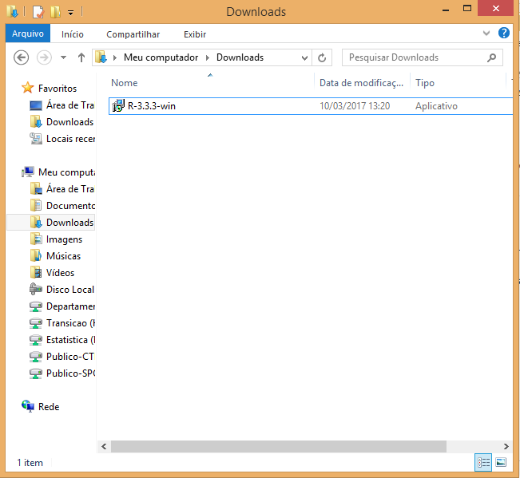

```{r setup, include=FALSE}
knitr::opts_chunk$set(echo = FALSE, fig.align = "center")
```

### Sobre este tutorial

A primeira coisa que você precisa fazer é instalar o R e o RStudio. O que
está sendo chamado aqui de "R" é o programa que ficará no seu computador e
permitirá que ele entenda os comandos que você escrever em R. Já "RStudio"
é algo completamente diferente: esse é um editor de texto onde você
escreverá os seus programas em R.

Apesar de você poder escrever um programa em R em literalmente qualquer
lugar (desde o Notepad até o Word), o RStudio é o ideal porque ele entende
bastante de R e pode ajudar você a lembrar o nome de comandos, corrigir enganos
se você tiver escrito alguma coisa errada e salvar os gráficos que você
gerar.

Todo o resto deste tutorial assume que você esteja em um computador Windows.
Se esse não for o seu caso, por favor siga as instruções
[neste documento](http://leg.ufpr.br/~fernandomayer/aulas/ce083-2016-2/R-instalacao.html)
ou [neste](https://www.vivaolinux.com.br/dica/Instalando-o-R-e-Rstudio-no-Ubuntu).

### Instalando o R

Para instalar o R, a primeira coisa que você precisa fazer é baixar o programa.
Entre [neste site](https://cran.r-project.org/bin/windows/base/) e clique em
**Download R X.X.X for Windows** (onde X.X.X é o número da versão mais recente),
o maior link no topo da página.

Salve o arquivo no seu computador, por exemplo na pasta **Downloads**. Abaixo
você pode ver um exemplo de quando a versão mais recente era a 3.3.3.

```{r}

```

Clique no arquivo duas vezes com o botão esquerdo. Escolha a linguagem da
instalação e clique em **OK**.

A seguir clique em **Avançar** até chegar na tela da imagem abaixo. A
recomendação é usar a pasta padrão para instalação; se você quiser
instalar o R para todos os usuários da sua máquina, você precisará do
acesso de administrador.

```{r}

```


