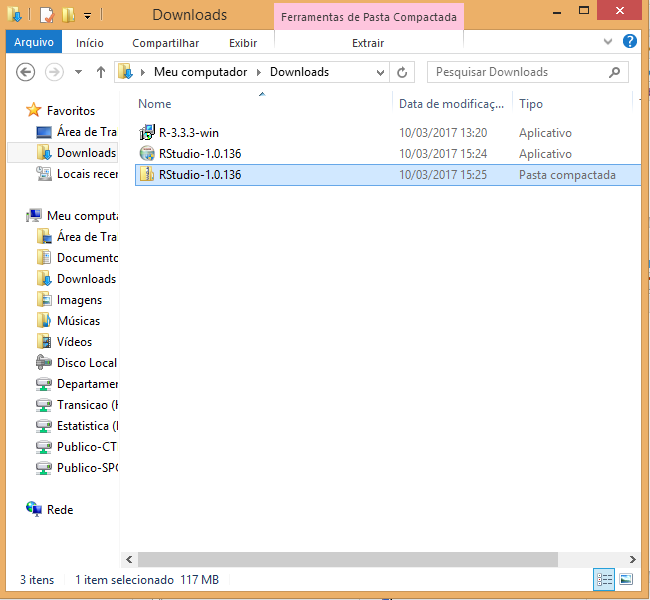
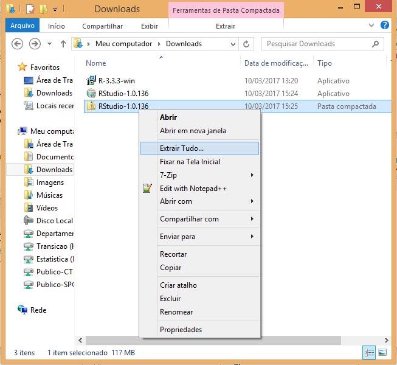

```{r setup, include=FALSE}
knitr::opts_chunk$set(echo = FALSE, fig.align = "center")
```

### Sobre este tutorial

A primeira coisa que você precisa fazer é instalar o R e o RStudio. O que
está sendo chamado aqui de "R" é o programa que ficará no seu computador e
permitirá que ele entenda os comandos que você escrever em R. Já "RStudio"
é algo completamente diferente: esse é um editor de texto onde você
escreverá os seus programas em R.

Apesar de você poder escrever um programa em R em literalmente qualquer
lugar (desde o Notepad até o Word), o RStudio é o ideal porque ele entende
bastante de R e pode ajudar você a lembrar o nome de comandos, corrigir enganos
se você tiver escrito alguma coisa errada e salvar os gráficos que você
gerar.

Todo o resto deste tutorial assume que você esteja em um computador Windows.
Se esse não for o seu caso, por favor siga as instruções
[neste documento](http://leg.ufpr.br/~fernandomayer/aulas/ce083-2016-2/R-instalacao.html)
ou [neste](https://www.vivaolinux.com.br/dica/Instalando-o-R-e-Rstudio-no-Ubuntu).

### Instalando o R

Para instalar o R, a primeira coisa que você precisa fazer é baixar o programa.
Entre [neste site](https://cran.r-project.org/bin/windows/base/) e clique em
**Download R X.X.X for Windows** (onde X.X.X é o número da versão mais recente),
o maior link no topo da página.

Salve o arquivo no seu computador, por exemplo na pasta **Downloads**. Abaixo
você pode ver um exemplo de quando a versão mais recente era a 3.3.3.

```{r}
knitr::include_graphics("README_files/01_r_salvo.png")
```

Clique no arquivo duas vezes com o botão esquerdo. Escolha a linguagem da
instalação e clique em **OK**.

A seguir clique em **Avançar** até chegar na tela da imagem abaixo. A
recomendação é usar a pasta padrão para instalação; se você quiser
instalar o R para todos os usuários da sua máquina, você precisará do
acesso de administrador.

```{r}
knitr::include_graphics("README_files/02_r_pasta.png")
```

Continue clicando em **Avançar** até chegar em **Concluir**. Pronto!
Agora R já está instalado.

### Instalando o RStudio

Para instalar o RStudio, o nosso editor de texto, você precisa entrar
[neste link](https://www.rstudio.com/products/rstudio/download/) e
descer até o final da página.

```{r}
knitr::include_graphics("README_files/03_rstudio_download.png")
```

Nessa página você tem duas opções:

1. Se você tiver acesso administrador, clique no link chamado
**Windows Vista/7/8/10** na seção **Installers for Supported Platforms**. Em
seguida a instalação será bem simples: fazer o download, abrir o instalador e
ir clicando no botão **Avançar**.

2. Se você não tiver acesso de administrador, clique no link chamado
**Windows Vista/7/8/10** na seção **Zip/Tarballs**.

#### Se você é administrador

Clique duas vezes no arquivo que você baixou da página do RStudio e siga as
instruções de instalação.

```{r}
knitr::include_graphics("README_files/04_rstudio_instalador.png")
```

#### Se você não é administrador

Se você clicou no link da lista **Zip/Tarballs**, você deve ter baixado um
arquivo do tipo ".zip".

```{r}

```

Clique com o botão direito no arquivo e selecione a opção **Extrair Tudo...**
conforme a imagem abaixo.

```{r}

```

Você verá uma tela para extrair a pasta compactada. Não mude nada e clique em
extrair. Pode demorar um pouco, mas depois que o processo acabar você verá
que foi criada uma nova pasta chamada **RStudio-X.X.X** (onde, mais uma vez,
o X.X.X é número da versão mais recente).

Abra essa pasta e entre na subpasta com nome **bin**. Em seguida, procure pelo
arquivo chamado **rstudio** e clique duas vezes. Isso abrirá o RStudio!

A recomendação é fixar o programa na barra de tarefas para que você não precise
ficar procurando essa pasta toda vez. A única coisa é que você *não* pode deletar
a pasta **RStudio-X.X.X** porque o RStudio vai depender dela para funcionar.

```{r}
knitr::include_graphics("README_files/07_rstudio_bin.png")
```

### O primeiro comando

Com o RStudio aberto, você verá a tela abaixo. O primeiro comando que você vai
executar instala uma série de "bibliotecas" com utilitários para análises de
dados. Uma "biblioteca" ou "pacote" não passa de uma coleção de códigos em R
já prontos que você pode invocar para facilitar a sua vida; assim você não
precisa reinventar a roda toda vez que for tratar uma base.

No console digite `install.packages("tidyverse")` e aperte a tecla **Enter**.
Se você tiver digitado tudo certo, textos diversos começarão a aparecer na
tela e, ao final, você verá a mensagem
**package ‘tidyverse’ successfully unpacked and MD5 sums checked**.

```{r}
knitr::include_graphics("README_files/08_rstudio_tidyverse.png")
```

E pronto! Agora você está preparado para começar a aprender R de verdade.

### Nota

Todas as imagens e passo-a-passos deste tutorial foram fornecidos pela
[Curso-R](https://www.curso-r.com/), uma empresa fundada por ex-alunos da USP
que disponibiliza gratuitamente em seu site diversos materiais e curiosidades
sobre a linguagem R.
