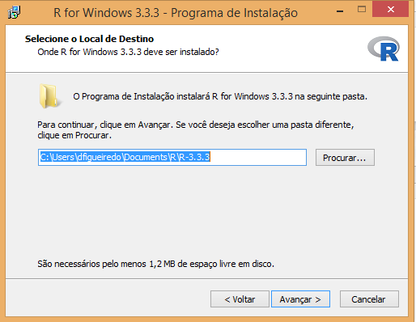
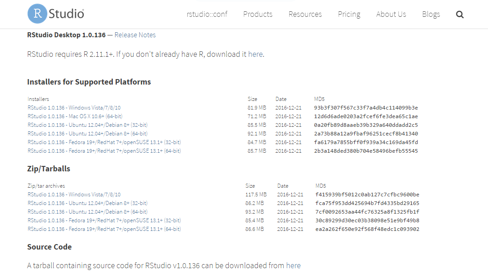
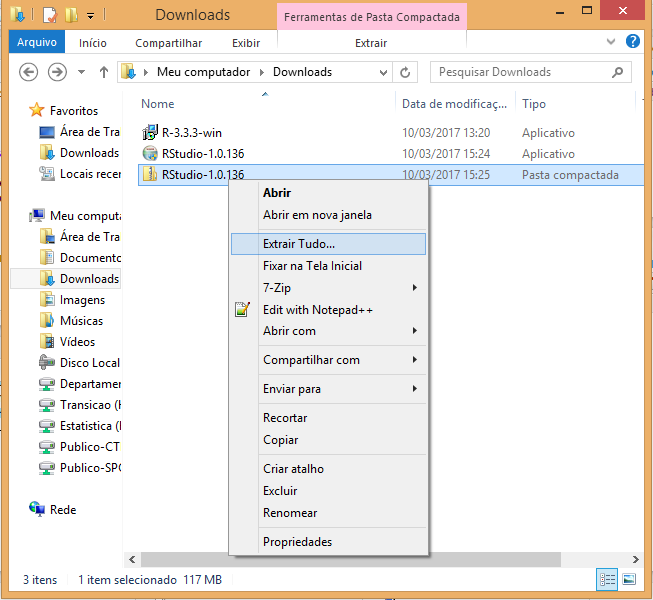
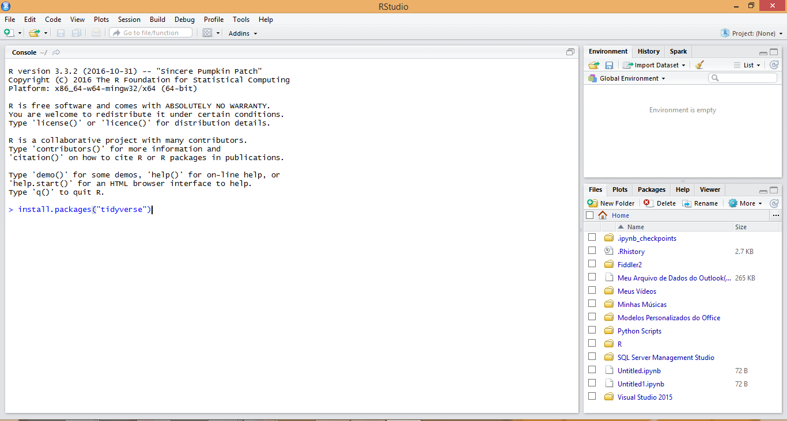

Tutorial 01: Instalação
================

### Sobre este tutorial

O primeiro passo de todos é instalar o R e o RStudio. O que está sendo
chamado aqui de “R” é o programa que ficará no seu computador e
permitirá que ele entenda os comandos que você escrever em R. Já
“RStudio” é algo completamente diferente: esse é um editor de texto
onde você escreverá os seus programas em R.

Apesar de você poder escrever um programa em R em literalmente qualquer
lugar (desde o Notepad até o Word), o RStudio é o ideal porque ele
entende bastante de R e pode ajudar você a lembrar o nome de comandos,
corrigir enganos se você tiver escrito alguma algo errado e salvar os
gráficos que você gerar. A inferface do RStudio também é extremamente
amigável, permitindo que não programadores consigam se ambientar com
facilidade.

Todo o resto deste tutorial assume que você esteja em um computador
Windows. Se esse não for o seu caso, por favor siga as instruções [neste
documento](http://leg.ufpr.br/~fernandomayer/aulas/ce083-2016-2/R-instalacao.html)
ou
[neste](https://www.vivaolinux.com.br/dica/Instalando-o-R-e-Rstudio-no-Ubuntu).

### Instalando o R

Para instalar o R, primeiramente você precisa baixar o programa. Entre
[neste site](https://cran.r-project.org/bin/windows/base/) e clique em
**Download R X.X.X for Windows** (onde X.X.X é o número da versão mais
recente), o maior link no topo da página.

Salve o arquivo no seu computador, por exemplo na pasta **Downloads**.
Abaixo você pode ver um exemplo de quando a versão mais recente era a
3.3.3.

<!-- -->

Clique no arquivo duas vezes com o botão esquerdo. Escolha a linguagem
da instalação e clique em **OK**.

A seguir clique em **Avançar** até chegar na tela da imagem abaixo. A
recomendação é usar a pasta padrão para instalação; se você quiser
instalar o R para todos os usuários da sua máquina, você precisará do
acesso de administrador.

<!-- -->

Continue clicando em **Avançar** até chegar em **Concluir**. Pronto\!
Agora R já está instalado.

### Instalando o RStudio

Para instalar o RStudio, o nosso editor de texto, você precisa entrar
[neste link](https://www.rstudio.com/products/rstudio/download/) e
descer até o final da página.

<!-- -->

Nessa página você tem duas opções:

1.  Se você tiver acesso administrador, clique no link chamado **Windows
    Vista/7/8/10** na seção **Installers for Supported Platforms**. Em
    seguida a instalação será bem simples: fazer o download, abrir o
    instalador e ir clicando no botão **Avançar**.

2.  Se você não tiver acesso de administrador, clique no link chamado
    **Windows Vista/7/8/10** na seção **Zip/Tarballs**.

#### Se você é administrador

Clique duas vezes no arquivo que você baixou da página do RStudio e siga
as instruções de instalação.

<!-- -->

#### Se você não é administrador

Se você clicou no link da lista **Zip/Tarballs**, você deve ter baixado
um arquivo do tipo “.zip”.

<!-- -->

Clique com o botão direito no arquivo e selecione a opção **Extrair
Tudo…** conforme a imagem abaixo.

<!-- -->

Você verá uma tela para extrair a pasta compactada. Não mude nada e
clique em extrair. Pode demorar um pouco, mas depois que o processo
acabar você verá que foi criada uma nova pasta chamada **RStudio-X.X.X**
(onde, mais uma vez, o X.X.X é número da versão mais recente).

Abra essa pasta e entre na subpasta com nome **bin**. Em seguida,
procure pelo arquivo chamado **rstudio** e clique duas vezes. Isso
abrirá o RStudio\!

A recomendação é fixar o programa na barra de tarefas para que você não
precise ficar procurando essa pasta toda vez. Só é importante lembrar
que você *não* poderá deletar a pasta **RStudio-X.X.X** porque o RStudio
vai depender dela para funcionar.

<!-- -->

### O primeiro comando

Com o RStudio aberto, você verá a tela abaixo. O primeiro comando que
você vai executar instala uma série de “bibliotecas” com utilitários
para análises de dados. Uma “biblioteca” ou “pacote” não passa de uma
coleção de códigos em R já prontos que você pode usar para facilitar a
sua vida; assim você não precisa reinventar a roda toda vez que for
tratar uma base.

No console digite `install.packages("tidyverse")` e aperte a tecla
**Enter**. Se você tiver digitado tudo certo, textos diversos começarão
a aparecer na tela e, ao final, você verá a mensagem **package
‘tidyverse’ successfully unpacked and MD5 sums checked**.

O `tidyverse` será explicado mais para frente, então não se preocupe se
você não souber o que ele é.

<!-- -->

E pronto\! Agora você está preparado para começar a aprender R de
verdade.

### Referências

Todas as imagens deste tutorial foram extraídas de
<https://material.curso-r.com/>. Último acesso em 26/09/2018.
