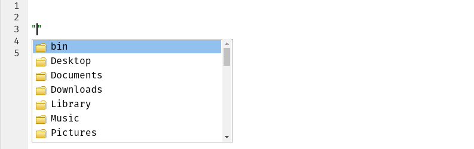
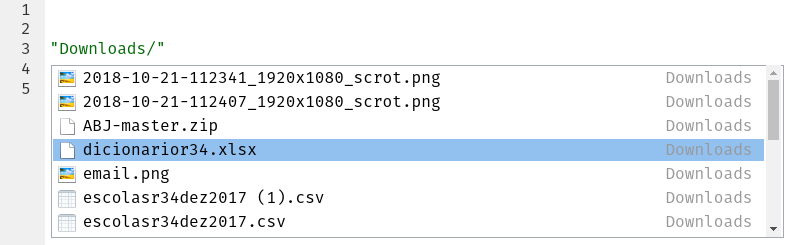

```{r setup, include=FALSE}
knitr::opts_chunk$set(echo = TRUE, comment = "#>")
```

### Sobre este tutorial

Quando você estiver prestes a analisar uma tabela ou base de dados, a sua
primeira tarefa será importar esses dados para o R. Em outras palavras,
você precisará converter um arquivo Excel/CSV/... para um objeto como o
que foi visto no tutorial passado.

Neste tutorial você baixará duas tabelas do portal
[Dados Abertos](http://dados.prefeitura.sp.gov.br/) da Prefeitura de São Paulo
e importará elas para o R.

### Baixando os dados

Para este tutorial vamos usar os dados do
[cadastro de escolas municipais, conveniadas e privadas](http://dados.prefeitura.sp.gov.br/dataset/cadastro-de-escolas-municipais-conveniadas-e-privadas).
As duas tabelas que vamos utilizar estão hospedadas nos links a seguir (clique
neles para baixá-las):
[dicionário](http://dados.prefeitura.sp.gov.br/dataset/8da55b0e-b385-4b54-9296-d0000014ddd5/resource/52b8a68b-ad4f-4f56-95ec-c2b0da052849/download/dicionarior34.xlsx) e
[cadastro](http://dados.prefeitura.sp.gov.br/dataset/8da55b0e-b385-4b54-9296-d0000014ddd5/resource/dfa2e046-b975-4ff5-983f-dacfd8cb06b2/download/escolasr34dez2017.csv).

No dia-a-dia é muito comum receber tabelas como estas por email ou mesmo criá-las
por conta própria a partir de dados brutos. O fato é que estes são os dois
formatos mais comuns de se ver no mundo real: Excel e CSV (abreviação do inglês
para "valores separados por vírgula").

### Achando um arquivo

Para ler o dicionário (contido no arquivo `dicionarior34.xlsx`), é necessário
primeiro encontrá-lo no seu computador. Se você baixou o arquivo pelo link acima,
provavelmente ele está na sua pasta de **Downloads**. Para verificar se este é
o caso, você vai utilizar uma ferramenta do RStudio: auto-preenchimento de
caminhos.

Em um arquivo .R, abra e feche parênteses em uma linha vazia. Com o cursor entre
os dois parênteses, aperte a tecla **Tab** e perceba que se abriu um pequeno
menu com nomes de pastas e/ou arquivos.

```{r, echo=FALSE}

```

Isso é o RStudio te ajudando a encontrar seus arquivos! No meu computador, o
dicionário está em **Downloads**, então uso as seta para baixo até chegar nesta
pasta e clico **Tab** para selecioná-la.

```{r, echo=FALSE}

```

Na imagem acima, já entrei na pasta. Agora só resta descer até o nome do arquivo
propriamente dito e selecioná-lo com **Tab** mais uma vez.

Obs.: Se você precisar *voltar* uma pasta, ou seja, ir para uma pasta mais externa
do que a na qual você se encontra, basta escrever "../" (ou "../../" para voltar
duas pastas e assim por diante).

É prática comum salvamos o caminho para um arquivo em uma variável. Isso permite
que seja fácil reutilizar este objeto e modificá-lo caso você precise mudar o
arquivo de lugar.

```{r, eval=FALSE}
# Meu caminho para o arquivo (o seu pode ser diferente!)
caminho_dicionario <- "Downloads/dicionarior34.xlsx"
```

```{r, echo=FALSE}
caminho_dicionario <- "README_files/dicionarior34.xlsx"
```

### Importando Excel

Você deve ter notado pelo próprio nome do arquivo, mas o dicionário de
variáveis é um arquivo Excel. Quando você instalou o `tidyverse`, você
também instalou um conjunto completo de funções para ler arquivos Excel!
Para carregar este pacote, basta rodar o comando a seguir:

```{r}
library(readxl)
```

A partir daí ler o arquivo é uma tarefa fácil. Você só precisa usar a
função `read_xlsx()` ("ler xlsx" em inglês):

```{r}
dicionario <- read_xlsx(caminho_dicionario)

dicionario
```

`read_xlsx()` recebe como principal argumento um texto contendo o caminho
para o arquivo Excel (neste caso, o caminho está no objeto
`caminho_dicionario`). O retorno dela é uma tabela bem semelhante à que você
viu no tutorial passado e aqui estamos salvando ela em um objeto `dicionario`.

Rode o comando abaixo para examinar a tabela por inteiro. A primeira coluna
tem nomes de variáveis, enquanto a segunda tem o que cada uma destas variáveis
significa; essas informações serão importantes quando você importar o segundo
arquivo baixado durante a primeira parte deste tutorial.

```{r, eval=FALSE}
View(dicionario)
```


Obs.: Às vezes você vai se deparar com um arquivo Excel mais antigo, com a
extensão ".xls". Neste caso use a função apropriadamente nomeada
`read_xls()`.

### Importando CSV

Arquivos com valores separados por vírgula (ou CSVs) são também bastante comuns
por serem um formato universal e bastante leve. Você pode gerar arquivos assim
com o próprio Excel, permitindo que pessoas sem o programa possam lê-lo.

No caso deste tutorial iremos importar o arquivo com os cadastros das escolas:
`escolasr34dez2017.csv`. Assim como para o dicionário, utilize o mesmo processo
para encontrar este arquivo.

```{r, eval=FALSE}
# Meu caminho para o arquivo (o seu pode ser diferente!)
caminho_cadastro <- "Downloads/escolasr34dez2017.csv"
```

```{r, echo=FALSE}
caminho_cadastro <- "README_files/escolasr34dez2017.csv"
```

A partir de agora o processo fica um pouco diferente da leitura do Excel.
Arquivos CSV são universais, mas infelizmente eles não possuem um padrão tão
forte quanto outros tipos de arquivo; dependendo do idioma do seu computador
e do idioma do computador de quem escreveu o arquivo, ele pode ser salvo de
formas diferentes!

Ao ler um arquivo ".csv" você pode encontrar dois principais problemas: de
formato e de codificação (ou *encoding* em inglês).

- Em inglês, o separador de decimais é o ponto ("123.45" ao invés de "123,45")
e esta diferença pode gerar problemas na hora de salvar um arquivo CSV! Quando
o seu computador está em português pode ser que ele tente manter a vírgula como
separador decimal no CSV, gerando um tipo de arquivo comumente chamado de CSV2.
Em resumo, você precisará usar uma função diferente para lê-lo.

- Codificação é um termo que diz respeito à forma com que o seu computador
salva arquivos. Este tópico é muito extenso para cobrir neste tutorial, mas é
importante saber que letras com acentos podem ser salvas de formas diferentes
por diferentes computadores. Caso você se depare com caracteres malucos ao
ler um arquivo, provavelmente você está vendo o resultado de um problema na
codificação do mesmo.

No meu computador eu me deparo com ambos estes problemas relatados acima! A
verdade é que eles são realmente bastante comuns, então não é de se surpreender.
O que você precisa aprender é a contorná-los.

Como o arquivo que você baixou é um CSV e não temos nenhuma informação extra
sobre ele, a primeira tentativa deve ser usar a função `read_csv()` ("ler csv").
Ela está no pacote `tidyverse` propriamente dito, então carregue-o antes.

```{r, message=FALSE}
library(tidyverse)

cadastro <- read_csv(caminho_cadastro)
```

Observe a linha que diz "*Warning: 1139 parsing failures*"; isso significa
"Alerta: 1139 falhas de processamento"! Provavelmente alguma coisa deu errado...
Veja o que foi salvo no objeto `cadastro`:

```{r}
cadastro
```

### Importando CSV2

Perceba que ele leu tudo como se fosse apenas uma coluna! Esse erro é
extremamente comum quando se tenta ler um CSV2 como se fosse um CSV normal. Como
descrito acima, eles são bem diferentes apesar de terem a mesma extensão...

```{r, message=FALSE}
cadastro <- read_csv2(caminho_cadastro)

cadastro
```

Agora parece que o arquivo foi lido corretamente, bastou utilizar a função
`read_csv2()`. São 6878 linhas e 53 colunas, um arquivo razoavelmente pequeno
mas que já seria um pouco pesado para o Excel; felizmente você está usando o R,
uma ferramenta extremamente otimizada.

Assim como com `dicionario`, rode o comando abaixo para examinar a tabela
inteira:

```{r, eval=FALSE}
View(cadastro)
```

### Problemas de codificação

Se você tem olhos de águia, pode ser que você tenha reparados alguns caracteres
estranhos nas colunas com textos. Abaixo você pode ver o que foi salvo na sexta
linha da coluna `ENDERECO`:

```{r}
cadastro$ENDERECO[6]
```

Isso é um clássico problema de codificação ou *encoding*, pois é evidente que a
segunda palavra deveria ser "JOÃO" e não esta confusão de letras e números. Isso
quer dizer que você precisará mudar o *encoding* na hora de ler o arquivo:

```{r}
guess_encoding(caminho_cadastro)
```

A função `guess_encoding()` ("adivinhar codificação") retorna uma pequena tabela
em que cada linha é um palpite sobre a codificação do arquivo. Neste caso, ela
tem apenas um palpite chamado "ISO-8859-1"; este é um código que pode ser
utilizado pelo R para ler o arquivo corretamente.

No comando abaixo é demonstrado como fazer para mudar a codificação na hora de
importar um arquivo. Primeiramente você deve criar um objeto com o código do
*encoding* usando a função `locale()` e depois você deve passar este objeto
como sendo o valor do argumento `locale` da função `read_csv2()` (ou qualquer
outra função de importação que você estiver utilizando).

```{r, message=FALSE}
codificacao <- locale(encoding = "ISO-8859-1")
cadastro <- read_csv2(caminho_cadastro, locale = codificacao)

cadastro$ENDERECO[6]
```

Pronto! Depois de algumas tentativas, você conseguiu criar o objeto cadastro
corretamente. No próximo tutorial usaremos esta tabela para aprender a mexer com
dados no R.
