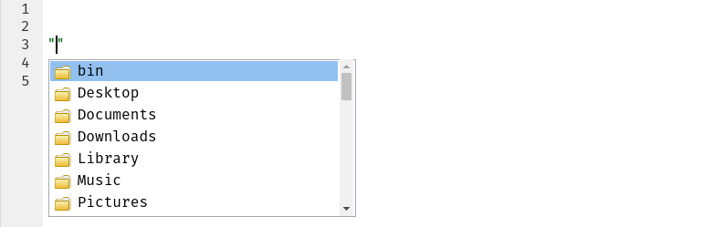

Tutorial 04: Importação
================

### Sobre este tutorial

Quando você estiver prestes a analisar uma tabela ou base de dados, a
sua primeira tarefa será importar esses dados para o R. Em outras
palavras, você precisará converter um arquivo Excel/CSV/… para um objeto
como o que foi visto no tutorial passado.

Neste tutorial, você importará para o R duas tabelas referentes a educação municipal de São Paulo, disponibilizadas no Portal [Dados
Abertos](http://dados.prefeitura.sp.gov.br/) da Prefeitura de São Paulo.

### Importando os dados

Para este tutorial vamos usar os dados da base ["Cadastro de escolas
municipais, conveniadas e
privadas"](http://dados.prefeitura.sp.gov.br/dataset/cadastro-de-escolas-municipais-conveniadas-e-privadas).
As duas tabelas que vamos utilizar estão hospedadas nos links a seguir
(clique neles para baixá-las):
[dicionário](http://dados.prefeitura.sp.gov.br/dataset/8da55b0e-b385-4b54-9296-d0000014ddd5/resource/52b8a68b-ad4f-4f56-95ec-c2b0da052849/download/dicionarior34.xlsx)
e
[cadastro](http://dados.prefeitura.sp.gov.br/dataset/8da55b0e-b385-4b54-9296-d0000014ddd5/resource/dfa2e046-b975-4ff5-983f-dacfd8cb06b2/download/escolasr34dez2017.csv).

No dia-a-dia, é muito comum receber tabelas como estas por email ou mesmo
criá-las por conta própria a partir de dados brutos. O fato é que estes
são os dois formatos mais comuns de se ver no mundo real: Excel e CSV
(abreviação do inglês para “valores separados por vírgula”).

### Achando um arquivo

Para ler o dicionário (contido no arquivo `dicionarior34.xlsx`), é
necessário primeiro encontrá-lo no seu computador. Se você baixou o
arquivo pelo link acima, provavelmente ele está na sua pasta de
**Downloads**. Para verificar se este é o caso, você vai utilizar uma
ferramenta do RStudio: auto-preenchimento de caminhos.

Em um arquivo .R, abra e feche parênteses em uma linha vazia. Com o
cursor entre os dois parênteses, aperte a tecla **Tab** e perceba que se
abriu um pequeno menu com nomes de pastas e/ou arquivos.

<!-- -->

Isso é o RStudio te ajudando a encontrar seus arquivos\! No meu
computador, o dicionário está em **Downloads**, então uso as seta para
baixo até chegar nesta pasta e clico **Tab** para selecioná-la.

<!-- -->

Na imagem acima, já entrei na pasta. Agora só resta descer até o nome do
arquivo propriamente dito e selecioná-lo com **Tab** mais uma vez.

Obs.: Se você precisar *voltar* uma pasta, ou seja, ir para uma pasta
mais externa do que a na qual você se encontra, basta escrever “../” (ou
“../../” para voltar duas pastas e assim por diante).

É prática comum salvarmos o caminho para um arquivo em uma variável. Isso
permite que seja fácil reutilizar este objeto e modificá-lo caso você
precise mudar o arquivo de lugar.

``` r
# Meu caminho para o arquivo (o seu pode ser diferente!)
caminho_dicionario <- "Downloads/dicionarior34.xlsx"
```

### Importando Excel

Você deve ter notado pelo próprio nome do arquivo, mas o dicionário de
variáveis é um arquivo Excel. Quando você instalou o `tidyverse`, você
também instalou um conjunto completo de funções para ler arquivos
Excel\! Para carregar este pacote, basta rodar o comando a seguir:

``` r
library(readxl)
```

A partir daí, ler o arquivo é uma tarefa fácil. Você só precisa usar a
função `read_xlsx()` (“ler xlsx” em inglês):

``` r
dicionario <- read_xlsx(caminho_dicionario)

dicionario
```

    #> # A tibble: 55 x 2
    #>    CAMPO     DESCRIÇÃO                                                    
    #>    <chr>     <chr>                                                        
    #>  1 DRE       sigla da Diretoria Regional de Educação (descrição no campo …
    #>  2 CODESC    código EOL da escola (Escola On Line, sistema da Secretaria …
    #>  3 TIPOESC   "tipo da escola:\r\nCCA -Centro para Crianças e Adolescentes…
    #>  4 NOMESC    nome da escola                                               
    #>  5 DIRETORIA Nome da Diretoria Regional de Educação - DRE                 
    #>  6 SUBPREF   subprefeitura onde se localiza a escola                      
    #>  7 CEU       nome do Centro de Educação Unificado - CEU da escola, quando…
    #>  8 ENDERECO  endereço da escola                                           
    #>  9 NUMERO    número da escola                                             
    #> 10 BAIRRO    bairro da escola                                             
    #> # ... with 45 more rows

`read_xlsx()` recebe como principal argumento um texto contendo o
caminho para o arquivo Excel (neste caso, o caminho está no objeto
`caminho_dicionario`). O retorno dela é uma tabela bem semelhante à que
você viu no tutorial passado e aqui estamos salvando ela em um objeto
`dicionario`.

Rode o comando abaixo para examinar a tabela por inteiro. A primeira
coluna tem nomes de variáveis, enquanto a segunda tem o que cada uma
destas variáveis significa; essas informações serão importantes quando
você importar o segundo arquivo baixado durante a primeira parte deste
tutorial.

``` r
View(dicionario)
```

Obs.: Às vezes você vai se deparar com um arquivo Excel mais antigo, com
a extensão “.xls”. Neste caso use a função apropriadamente nomeada
`read_xls()`.

### Importando CSV

Arquivos com valores separados por vírgula (ou CSVs) são também bastante
comuns por serem um formato universal e bastante leve. Você pode gerar
arquivos assim com o próprio Excel, permitindo que pessoas sem o
programa possam lê-lo.

No caso deste tutorial iremos importar o arquivo com os cadastros das
escolas: `escolasr34dez2017.csv`. Assim como para o dicionário, utilize
o mesmo processo para encontrar este arquivo.

``` r
# Meu caminho para o arquivo (o seu pode ser diferente!)
caminho_cadastro <- "Downloads/escolasr34dez2017.csv"
```

A partir de agora, o processo fica um pouco diferente da leitura do
Excel. Arquivos CSV são universais, mas infelizmente eles não possuem um
padrão tão forte quanto outros tipos de arquivo; dependendo do idioma do
seu computador e do idioma do computador de quem escreveu o arquivo, ele
pode ser salvo de formas diferentes\!

Ao ler um arquivo “.csv” você pode encontrar dois principais problemas:
de formato e de codificação (ou *encoding* em inglês).

  - Em inglês, o separador de decimais é o ponto (“123.45” ao invés de
    “123,45”) e esta diferença pode gerar problemas na hora de salvar
    um arquivo CSV\! Quando o seu computador está em português, pode ser
    que ele tente manter a vírgula como separador decimal no CSV,
    gerando um tipo de arquivo comumente chamado de CSV2. Em resumo,
    você precisará usar uma função diferente para lê-lo.

  - Codificação é um termo que diz respeito à forma com que o seu
    computador salva arquivos. Este tópico é muito extenso para cobrir
    neste tutorial, mas é importante saber que letras com acentos podem
    ser salvas de formas diferentes por diferentes computadores. Caso
    você se depare com caracteres diferentes ao ler um arquivo,
    provavelmente você está vendo o resultado de um problema na
    codificação do mesmo.

No meu computador eu me deparo com ambos estes problemas relatados
acima\! A verdade é que eles são realmente bastante comuns, então não é
de se surpreender. Mas não se preocupe, é possível a contorná-los.

Como o arquivo que você baixou é um CSV e não temos nenhuma informação
extra sobre ele, a primeira tentativa deve ser usar a função
`read_csv()` (“ler csv”). Ela está no pacote `tidyverse` propriamente
dito, então carregue-o antes.

``` r
library(tidyverse)

cadastro <- read_csv(caminho_cadastro)
```

    #> Warning in rbind(names(probs), probs_f): number of columns of result is not
    #> a multiple of vector length (arg 1)

    #> Warning: 1139 parsing failures.
    #> row # A tibble: 5 x 5 col     row col   expected  actual    file                                 expected   <int> <chr> <chr>     <chr>     <chr>                                actual 1     3 <NA>  1 columns 2 columns 'README_files/escolasr34dez2017.csv' file 2     4 <NA>  1 columns 2 columns 'README_files/escolasr34dez2017.csv' row 3     5 <NA>  1 columns 2 columns 'README_files/escolasr34dez2017.csv' col 4     6 <NA>  1 columns 2 columns 'README_files/escolasr34dez2017.csv' expected 5     8 <NA>  1 columns 2 columns 'README_files/escolasr34dez2017.csv'
    #> ... ................. ... ...................................................................... ........ ...................................................................... ...... ...................................................................... .... ...................................................................... ... ...................................................................... ... ...................................................................... ........ ......................................................................
    #> See problems(...) for more details.

Observe a linha que diz “*Warning: 1139 parsing failures*”; isso
significa “Alerta: 1139 falhas de processamento”\! Provavelmente alguma
coisa deu errado… Veja o que foi salvo no objeto `cadastro`:

``` r
cadastro
```

    #> # A tibble: 6,878 x 1
    #>    `DRE;CODESC;TIPOESC;NOMESC;DIRETORIA;SUBPREF;CEU;ENDERECO;NUMERO;BAIRRO…
    #>    <chr>                                                                   
    #>  1 "G;000086;EMEI;PAULO CAMILHIER FLORENCANO;GUAIANASES;GUAIANASES;;RUA FE…
    #>  2 FO;000094;EMEI;VICENTE PAULO DA SILVA;FREGUESIA/BRASILANDIA;CASA VERDE/…
    #>  3 MP;000108;EMEF;JOSE ERMIRIO DE MORAIS                                   
    #>  4 BT;000191;EMEF;ALIPIO CORREA NETO                                       
    #>  5 PJ;000205;EMEBS;VERA LUCIA APARECIDA RIBEIRO                            
    #>  6 BT;000213;EMEI;ANTONIO CARLOS PACHECO E SILVA                           
    #>  7 FO;000221;EMEI;NAIR CORREA BUARQUE;FREGUESIA/BRASILANDIA;FREGUESIA/BRAS…
    #>  8 JT;000230;EMEI;MARIA YOLANDA DE SOUZA PINTO HAHNE                       
    #>  9 JT;000248;EMEI;WALFRIDO DE CARVALHO                                     
    #> 10 CL;000256;EMEI;WILMA ALVARENGA DE OLIVEIRA                              
    #> # ... with 6,868 more rows

### Importando CSV2

Perceba que ele leu tudo como se fosse apenas uma coluna\! Esse erro é
extremamente comum quando se tenta ler um CSV2 como se fosse um CSV
normal. Como descrito acima, eles são bem diferentes apesar de terem a
mesma extensão…

``` r
cadastro <- read_csv2(caminho_cadastro)

cadastro
```

    #> # A tibble: 6,878 x 53
    #>    DRE   CODESC TIPOESC NOMESC DIRETORIA SUBPREF CEU   ENDERECO NUMERO
    #>    <chr> <chr>  <chr>   <chr>  <chr>     <chr>   <chr> <chr>    <chr> 
    #>  1 G     000086 EMEI    PAULO… GUAIANAS… GUAIAN… <NA>  "RUA FE… 502   
    #>  2 FO    000094 EMEI    VICEN… FREGUESI… CASA V… <NA>  RUA DOU… 295   
    #>  3 MP    000108 EMEF    JOSE … SAO MIGU… SAO MI… <NA>  RUA SAO… 159   
    #>  4 BT    000191 EMEF    ALIPI… BUTANTA   BUTANTA <NA>  AVENIDA… 140   
    #>  5 PJ    000205 EMEBS   VERA … PIRITUBA  PIRITU… <NA>  RUA BEN… 206   
    #>  6 BT    000213 EMEI    ANTON… BUTANTA   BUTANTA <NA>  "AVENID… 90    
    #>  7 FO    000221 EMEI    NAIR … FREGUESI… FREGUE… <NA>  RUA SAN… 51    
    #>  8 JT    000230 EMEI    MARIA… JACANA/T… VILA M… <NA>  RUA GAS… 340   
    #>  9 JT    000248 EMEI    WALFR… JACANA/T… JACANA… <NA>  RUA VIC… 200   
    #> 10 CL    000256 EMEI    WILMA… CAMPO LI… CAMPO … <NA>  RUA INT… 395   
    #> # ... with 6,868 more rows, and 44 more variables: BAIRRO <chr>,
    #> #   CEP <chr>, TEL1 <chr>, TEL2 <chr>, FAX <chr>, SITUACAO <chr>,
    #> #   CODDIST <chr>, DISTRITO <chr>, SETOR <chr>, CODINEP <int>,
    #> #   CODCIE <int>, EH <dbl>, DT_CRIACAO <chr>, ATO_CRIACAO <chr>,
    #> #   DOM_CRIACAO <chr>, DT_INI_FUNC <chr>, DT_AUTORIZA <chr>,
    #> #   NOME_ANT <chr>, T2D3D <chr>, T2D3D16 <chr>, T2D3D15 <chr>,
    #> #   T2D3D14 <chr>, T2D3D13 <chr>, T2D3D12 <chr>, T2D3D11 <chr>,
    #> #   T2D3D10 <chr>, T2D3D09 <chr>, T2D3D08 <chr>, T2D3D07 <chr>,
    #> #   DTURNOS <chr>, DTURNOS16 <chr>, DTURNOS15 <chr>, DTURNOS14 <chr>,
    #> #   DTURNOS13 <chr>, DTURNOS12 <chr>, DTURNOS11 <chr>, DTURNOS10 <chr>,
    #> #   DTURNOS09 <chr>, DTURNOS08 <chr>, DTURNOS07 <chr>, LATITUDE <int>,
    #> #   LONGITUDE <int>, REDE <chr>, DATABASE <chr>

Agora parece que o arquivo foi lido corretamente, bastou utilizar a
função `read_csv2()`. São 6878 linhas e 53 colunas, um arquivo
razoavelmente pequeno mas que já seria um pouco pesado para o Excel;
felizmente você está usando o R, uma ferramenta extremamente otimizada.

Assim como com `dicionario`, rode o comando abaixo para examinar a
tabela inteira:

``` r
View(cadastro)
```

### Problemas de codificação

É possível observar que há alguns caracteres estranhos nas colunas com textos. Abaixo, veja o que
foi salvo na sexta linha da coluna `ENDERECO`:

``` r
cadastro$ENDERECO[6]
```

    #> [1] "AVENIDA JO\xc3O CAIAFFA"

Isso é um clássico problema de codificação ou *encoding*, pois é
evidente que a segunda palavra deveria ser “JOÃO” e não esta confusão de
letras e números. Isso quer dizer que você precisará mudar o *encoding*
na hora de ler o arquivo:

``` r
guess_encoding(caminho_cadastro)
```

    #> # A tibble: 1 x 2
    #>   encoding   confidence
    #>   <chr>           <dbl>
    #> 1 ISO-8859-1        0.3

A função `guess_encoding()` (“adivinhar codificação”) retorna uma
pequena tabela em que cada linha é um palpite sobre a codificação do
arquivo. Neste caso, ela tem apenas um palpite chamado “ISO-8859-1”;
este é um código que pode ser utilizado pelo R para ler o arquivo
corretamente.

No comando abaixo é demonstrado como nudar a codificação na
hora de importar um arquivo. Primeiramente, você deve criar um objeto com
o código do *encoding* usando a função `locale()` e depois você deve
passar este objeto como sendo o valor do argumento `locale` da função
`read_csv2()` (ou qualquer outra função de importação que você estiver
utilizando).

``` r
codificacao <- locale(encoding = "ISO-8859-1")
cadastro <- read_csv2(caminho_cadastro, locale = codificacao)

cadastro$ENDERECO[6]
```

    #> [1] "AVENIDA JOÃO CAIAFFA"

Pronto\! Depois de algumas tentativas, você conseguiu criar o objeto
cadastro corretamente. No próximo tutorial usaremos esta tabela para
aprender a mexer com dados no R.
