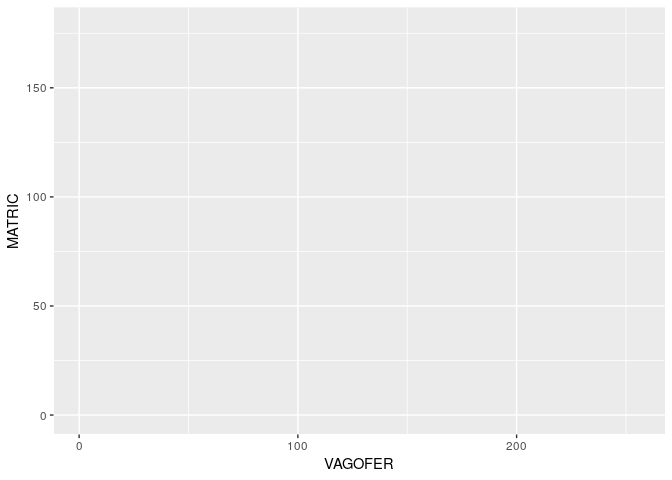
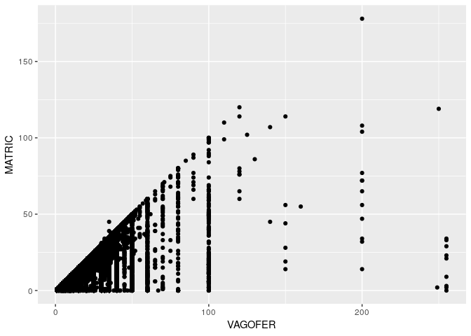
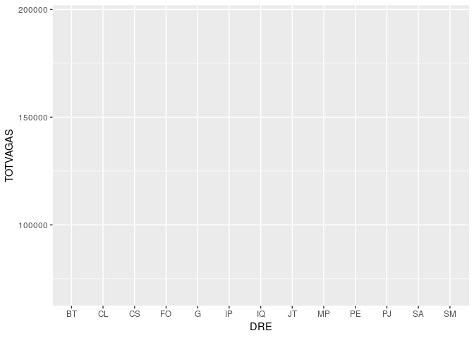
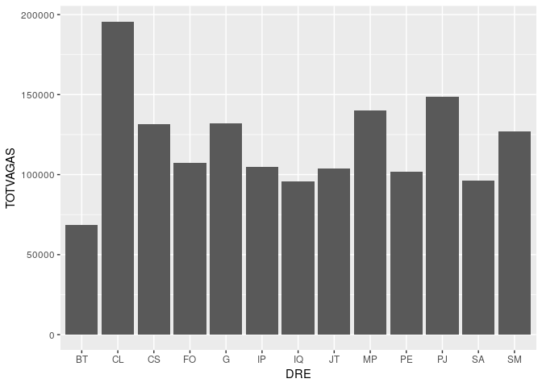
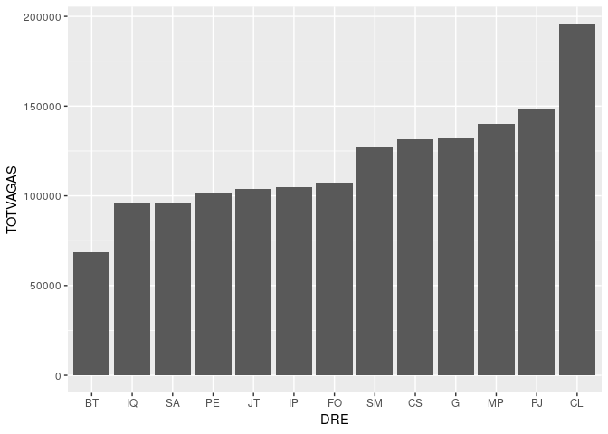
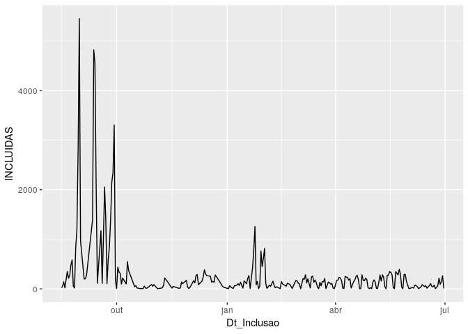

Tutorial 07: Gráficos (Parte 1)
================

### Sobre este tutorial

Agora que você já sabe o básico sobre tratamento de dados, o próximo
passo é aprender sobre visualização. Neste tutorial você vai aprender a
utilizar as principais funcionalidades da programoteca `ggplot2` (também
parte do `tidyverse`).

Neste tutorial será utilizada uma base de dados diferente das
anteriores. Ela diz respeito aos perfis das turmas e unidades
educacionais em funcionamento, podendo ser baixada através [deste
link](http://dados.prefeitura.sp.gov.br/dataset/afa17bfd-3286-4c40-87c9-52933066a592/resource/383dc680-ad8e-47ac-9c43-154325399eba/download/turmasjun18.csv).

``` r
library(tidyverse)

# Ler tabela das turmas (modificar o caminho de acordo com o seu computador)
turmas <- read_csv2(
  "Downloads/turmasjun18.csv",
  locale = locale(encoding = "ISO-8859-1"))
```

### Um primeiro gráfico

No R os gráficos têm três componentes principais: uma base, uma estética
e uma geometria. A base não passa da tabela utilizada para gerar aquele
gráfico, a estética é o conjunto de descrições que vai permitir que o
gráfico seja gerado (eixo x, eixo y, agrupamentos, etc.) e a geometria
diz respeito à forma geométrica da visualização (gráfico de barras,
gráfico de pontos, gráfico de linhas, etc.) e .

O primeiro gráfico que você fará é o de número de vagas por turma versus
o número de alunos efetivamente matriculados. Com o comando `ggplot()` é
possível fazer a base do
gráfico.

``` r
ggplot(turmas)
```


O segundo passo é escolher a estética com a função `aes()`. Neste caso,
as únicas especificações que precisam ser feitas são qual colunas deve
ficar em qual
eixo.

``` r
ggplot(turmas, aes(x = VAGOFER, y = MATRIC))
```



Agora é necessário escolher uma geometria. Tanto o número de vagas por
turma (`VAGOFER`) quanto o número de alunos matriculados (`MATRIC`) são
valores numéricos, então a geometria mais indicada é o gráfico de pontos
(que pode ser gerado com a função `geom_point()` (“geom ponto”)).

``` r
ggplot(turmas, aes(x = VAGOFER, y = MATRIC)) +
  geom_point()
```



Perceba que a função `geom_point()` fica fora da função `ggplot()`, elas
estão sendo somadas a pesar de estarem em linhas diferentes. Pense neste
`+` como o `%>%` que foi visto nos dois últimos tutoriais: ele passa o
que está à esquerda dele como entrada para o que está abaixo. Essa
mudança de notação pode ser um pouco confusa, mas é só lembrar que,
quando você estiver fazendo gráficos, o operador de conexão é o `+`.

Apesar de o comando acima fazer pleno sentido, é muito mais comum de se
ver a `aes()` dentro da função de geometria\! Isso acontece porque você
pode querer usar múltiplas geometrias com diferentes estéticas em um
mesmo gráfico. Desta forma não se assuste se você vir algo como o
comando abaixo:

``` r
# Outra forma de especificar a estética
ggplot(turmas) +
  geom_point(aes(x = VAGOFER, y = MATRIC))
```

### Tratamento + gráficos

Como você já aprendeu a tratar dados, você pode imaginar o quão útil não
seria fazer visualizações de colunas resumidas ou modificadas. A sua
tarefa agora é fazer um gráfico de barras com o número total de vagas
oferecidas em cada DRE.

O primeiro passo é realizar o cálculo do número de vagas por DRE.
Utilizando `group_by()` e `summarise()` isso pode ser feito em poucas
linhas:

``` r
turmas %>%
  group_by(DRE) %>%
  summarise(TOTVAGAS = sum(VAGOFER))
```

    #> # A tibble: 13 x 2
    #>    DRE   TOTVAGAS
    #>    <chr>    <int>
    #>  1 BT       68729
    #>  2 CL      195659
    #>  3 CS      131781
    #>  4 FO      107571
    #>  5 G       132214
    #>  6 IP      104973
    #>  7 IQ       95720
    #>  8 JT      104006
    #>  9 MP      139931
    #> 10 PE      101679
    #> 11 PJ      148898
    #> 12 SA       96217
    #> 13 SM      126869

Perceba que a saída do comando não deixa de ser uma tabela como qualquer
outra. É perfeitamente possível criar um novo objeto para conter esta
base de dados (como no final do tutorial 6), mas o R permite que esta
tabela seja enviada diretamente para a função `ggplot()`:

``` r
turmas %>%
  group_by(DRE) %>%
  summarise(TOTVAGAS = sum(VAGOFER)) %>%
  ggplot(aes(x = DRE, y = TOTVAGAS))
```



Por fim, é necessário escolher a geometria do gráfico. No caso do
gráfico de barras, a função mais indicada é `geom_col()` porque ela
consegue gerar colunas com dados numéricos.

``` r
turmas %>%
  group_by(DRE) %>%
  summarise(TOTVAGAS = sum(VAGOFER)) %>%
  ggplot(aes(x = DRE, y = TOTVAGAS)) +
  geom_col()
```



Obs.: Lembre-se que depois de passar pela função `ggplot()` é necessário
usar p `+` ao invés do `%>%`\!

Se você quiser ordenar as DRE por número total de vagas é necessário
usar um tipo de objeto ainda não apresentado: fatores. “Fator” não é
nada mais que a palavra do R para “variável categórica”, mas,
diferentemente das colunas de texto como `DRE`, é possível ordenar
colunas de fatores.

``` r
turmas %>%
  group_by(DRE) %>%
  summarise(TOTVAGAS = sum(VAGOFER)) %>%
  mutate(DRE = fct_reorder(DRE, TOTVAGAS)) %>%
  ggplot(aes(x = DRE, y = TOTVAGAS)) +
  geom_col()
```



Dentro da função `mutate()`, o comando acima transforma a coluna `DRE`
em um fator através da função `fct_reorder()` (“reordenar fator”); esta,
por sua vez, recebe uma coluna que deve virar um fator e uma coluna
indicando a ordenação (neste caso, `DRE` está sendo ordenada por ordem
crescente de `TOTVAGAS`).

### Datas + gráficos

Datas são um componente muito importante de visualizações de dados, mas
geralmente demandam um pouco de tratamento antes de poderem ser
utilizadas no R por causa das inúmeras formas nas quais elas podem ser
escritas.

Um gráfico interessante de se fazer com a base `turmas` é o de turmas
registradas no sistema ao longo do tempo, ou seja, em cada dia do ano
quantas turmas foram registradas em cada dia. Para isso você utilizará a
coluna `Dt_Inclusao` mas antes precisará transformá-la de texto para
data.

``` r
turmas %>%
  select(Dt_Inclusao)
```

    #> # A tibble: 74,991 x 1
    #>    Dt_Inclusao
    #>    <chr>      
    #>  1 28/02/2018 
    #>  2 16/03/2018 
    #>  3 19/03/2018 
    #>  4 28/02/2018 
    #>  5 28/02/2018 
    #>  6 28/02/2018 
    #>  7 28/02/2018 
    #>  8 13/03/2018 
    #>  9 28/02/2018 
    #> 10 31/08/2017 
    #> # ... with 74,981 more rows

O conjunto de funções `lubridate` (parte do `tidyverse`) têm uma série
de utilitários para converter textos em data: `dmy()`, `ymd()`, `mdy()`
e assim por diante. As letras destas funções correspondem a `d`-“dia”,
`m`-mês e `y`-“ano” e você precisa escolher a função cujas letras estão
na mesma ordem em que a coluna de interesse (neste caso a coluna está em
“DD/MM/AAAA”, fazendo com que seja necessário usar a função `dmy()`).

``` r
library(lubridate)

turmas %>%
  mutate(Dt_Inclusao = dmy(Dt_Inclusao)) %>%
  select(Dt_Inclusao)
```

    #> # A tibble: 74,991 x 1
    #>    Dt_Inclusao
    #>    <date>     
    #>  1 2018-02-28 
    #>  2 2018-03-16 
    #>  3 2018-03-19 
    #>  4 2018-02-28 
    #>  5 2018-02-28 
    #>  6 2018-02-28 
    #>  7 2018-02-28 
    #>  8 2018-03-13 
    #>  9 2018-02-28 
    #> 10 2017-08-31 
    #> # ... with 74,981 more rows

Perceba que agora o tipo da coluna mudou de `<chr>` (“texto”) para
`<date>` (“data”)\!

Com esta pequena transformação agora é possível fazer a coluna resumo
necessária para a visualização:

``` r
turmas %>%
  mutate(Dt_Inclusao = dmy(Dt_Inclusao)) %>%
  group_by(Dt_Inclusao) %>%
  summarise(INCLUIDAS = n())
```

    #> # A tibble: 259 x 2
    #>    Dt_Inclusao INCLUIDAS
    #>    <date>          <int>
    #>  1 2017-08-16         30
    #>  2 2017-08-17         40
    #>  3 2017-08-18        143
    #>  4 2017-08-19         19
    #>  5 2017-08-21        351
    #>  6 2017-08-22        213
    #>  7 2017-08-23        273
    #>  8 2017-08-24        480
    #>  9 2017-08-25        585
    #> 10 2017-08-26         54
    #> # ... with 249 more rows

Para visualizar dados contínuos ao longo do tempo, a geometria mais
interessante é o gráfico de linhas. A função a ser utilizada neste caso
é `geom_line()` (“geom linha”) e, com isso, você pode fazer o seu
último gráfico do módulo básico\!

``` r
turmas %>%
  mutate(Dt_Inclusao = dmy(Dt_Inclusao)) %>%
  group_by(Dt_Inclusao) %>%
  summarise(INCLUIDAS = n()) %>%
  ggplot(aes(x = Dt_Inclusao, y = INCLUIDAS)) +
  geom_line()
```


