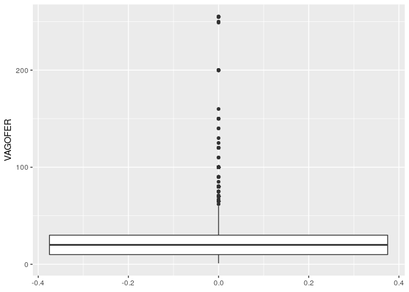

Tutorial 08: Gráficos (Parte 2)
================

### Sobre este tutorial

Neste tutorial você vai continuar a aprender sobre gráficos no R, mas
agora focando em algumas geometrias um pouco mais rebuscadas e em
agrupamentos. Assim como no tutorial passado, serão utilizados conceitos
dos tutoriais 5 e 6, então certifique-se de que você entendeu tudo que
foi ensinado durante eles.

Mais uma vez será utilizada a tabela `turmas` do tutorial passado, assim
não se esqueça de carregá-la em sua sessão do R antes de começar os
gráficos deste tutorial.

### Histogramas

De acordo com a [Wikipédia](https://pt.wikipedia.org/wiki/Histograma),
um histograma é:

> O histograma, também conhecido como distribuição de frequências, é a
> representação gráfica em colunas ou em barras (retângulos) de um
> conjunto de dados previamente tabulado e dividido em classes uniformes
> ou não uniformes.

Ou seja, um histograma permite visualizar a distribuição de uma única
variável. Ele é extremamente útil quando as medidas resumos de
`summary()` não são o suficiente para compreender como se comporta uma
variável numérica.

No código abaixo usamos `geom_histogram()` (“geom histograma”) para
entender a distribuição da coluna que representa o número de vagas
oferecidas em cada turma (`VAGOFER`):

``` r
library(tidyverse)

ggplot(turmas, aes(x = VAGOFER)) +
  geom_histogram()
```


Obs.: No caso de histogramas, o eixo y vai ser gerado automaticamente
como uma contagem do número de elementos no intervalo correspondente do
eixo x e por isso ele se chama “*count*” (“contagem”).

Note que o gráfico vai muito mais para a direita do que aparentemente é
necessário\! Isso acontece por causa do número extremamente elevado de
turmas com menos de 50 vagas, logo as barras depois do 100 ficam
pequenas demais para serem vistas. Você pode por exemplo analisar
somente as turmas com mais de 100 vagas para que as barras dessa região
fiquem visíveis:

``` r
turmas %>%
  filter(VAGOFER > 100) %>%
  ggplot(aes(x = VAGOFER)) +
  geom_histogram()
```


### *Box-plots*

Também conhecidos como “diagramas de caixa”, os *box-plots* são outra
ferramenta interessante para visualizar a distribuição de uma variável.
A diferença entre eles e os histogramas, é que os *box-plots*
representam uma coluna de forma compacta, permitindo que comparações
sejam mais simples de se visualizar. De acordo com a
[Wikipédia](https://pt.wikipedia.org/wiki/Diagrama_de_caixa):

> \[…\] diagrama de caixa, diagrama de extremos e quartis, boxplot ou
> box plot é uma ferramenta gráfica para representar a variação de dados
> observados de uma variável numérica por meio de quartis

Para fazer um *box-plot* no R basta usar a função `geom_boxplot()`\!

``` r
ggplot(turmas, aes(y = VAGOFER)) +
  geom_boxplot()
```



Perceba que no caso do *box-plot* para somente uma variável deve ser
especificado o eixo y e não o x. Repare também em como o primeiro
histograma e o *box-plot* mostram exatamente a mesma coisa mas de formas
diferentes; no *box-plot* é possível ver que a grande massa de turmas
tem poucas vagas (caixa branca) e que um conjunto muito menor tem
quantia elevada de vagas (pontos soltos).

O verdadeiro potencial dos *box-plots* é revelado entretanto quando se
utiliza uma outra coluna para quebrar a do eixo y. Neste caso, você pode
quebrar `VAGOFER` por `DRE` assim como foi feito no tutorial anterior.

``` r
ggplot(turmas, aes(x = DRE, y = VAGOFER)) +
  geom_boxplot()
```


Com este gráfico é possível perceber que a maioria das turmas de todas
as DREs possuem números de vagas muito parecidos (caixas brancas
alinhadas); no entanto existem algumas poucas DREs com turmas
excepcionalmente grandes (pontos soltos muito altos em IP, MP e SA).

### Agrupamentos

Até agora todos os gráficos que você viu são sempre de uma coluna versus
outra, mas é bastante comum ver mais variáveis sendo expressas em um
mesmo gráfico através de cores. Esse tipo de especificação deve ser
feito dentro de `aes()` com os parâmetros `color` (“cor”) para pontos e
linhas e/ou `fill` (“preenchimento”) para barras e colunas.

Para exemplificar o uso da cor em gráficos você irá utilizar o gráfico
de linhas do tutorial passado:

``` r
library(lubridate)

turmas %>%
  mutate(Dt_Inclusao = dmy(Dt_Inclusao)) %>%
  group_by(Dt_Inclusao) %>%
  summarise(INCLUIDAS = n()) %>%
  ggplot(aes(x = Dt_Inclusao, y = INCLUIDAS)) +
  geom_line()
```


Uma pergunta óbvia de se fazer ao olhar este gráfico é se há diferença
nos registros das turmas entre as diferentes DREs. Como existem muitas
DREs é útil escolher apenas algumas para visualizar através de um
`filter()`:

``` r
turmas %>%
  filter(DRE %in% c("IP", "MP", "SA")) %>%
  mutate(Dt_Inclusao = dmy(Dt_Inclusao)) %>%
  group_by(Dt_Inclusao) %>%
  summarise(INCLUIDAS = n()) %>%
  ggplot(aes(x = Dt_Inclusao, y = INCLUIDAS)) +
  geom_line()
```


Obs.: Perceba que agora o gráfico passa a só levar em conta as três DREs
selecionadas.

Abaixo você pode ver o código necessário para fazer três linhas, uma de
cada cor, de modo a visualizar as três DREs separadamente. Atente-se ao
fato de que `DRE` agora precisa ser uma das colunas pelas quais a tabela
está sendo agrupada\! Para incluir a cor nas linhas basta usar o
parâmetro `color` em `aes()`.

``` r
turmas %>%
  filter(DRE %in% c("IP", "MP", "SA")) %>%
  mutate(Dt_Inclusao = dmy(Dt_Inclusao)) %>%
  group_by(DRE, Dt_Inclusao) %>%
  summarise(INCLUIDAS = n()) %>%
  ggplot(aes(x = Dt_Inclusao, y = INCLUIDAS, color = DRE)) +
  geom_line()
```


Para fazer isso com gráficos de barra é tão simples quanto. Partindo do
gráfico de barras do tutorial passado, faça o mesmo filtro por DREs que
no gráfico passado e então use o parâmetro `fill` para quebrar as
barras. Neste caso, quebre as barras por `REDE`.

``` r
turmas %>%
  filter(DRE %in% c("IP", "MP", "SA")) %>%
  group_by(REDE, DRE) %>%
  summarise(TOTVAGAS = sum(VAGOFER)) %>%
  mutate(DRE = fct_reorder(DRE, TOTVAGAS)) %>%
  ggplot(aes(x = DRE, y = TOTVAGAS, fill = REDE)) +
  geom_col()
```


Como gráfico acima é possível ter uma noção do número de vagas por DRE
provenientes de cada rede\! Se você quiser que as barras fiquem lado a
lado basta usar o argumento `position` (“posição”) de `geom_col()` e
fazê-lo valer `"dodge"` (“esquivar”).

``` r
turmas %>%
  filter(DRE %in% c("IP", "MP", "SA")) %>%
  group_by(REDE, DRE) %>%
  summarise(TOTVAGAS = sum(VAGOFER)) %>%
  mutate(DRE = fct_reorder(DRE, TOTVAGAS)) %>%
  ggplot(aes(x = DRE, y = TOTVAGAS, fill = REDE)) +
  geom_col(position = "dodge")
```


